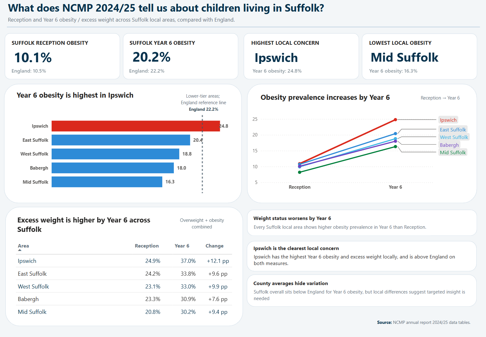

# NCMP 2024/25 Suffolk Power BI Dashboard

This is a single-page Power BI dashboard created for the Public Health & Communities - SQL / Power BI Developer interview exercise.

## Dashboard preview



## Question

**What does the NCMP data tell us about children living in Suffolk?**

## Key message

Suffolk overall sits below England for Year 6 obesity, but the overall local variation does still matter. Ipswich stands out as the highest local concern, and all Suffolk local areas show significantly higher obesity prevalence in Year 6 than Reception.

## Files

```text
.
├── data
│   ├── raw
│   │   └── NCMP-2024-2025-academic-year-data-tables_v2.ods
│   └── processed
│       ├── ncmp_suffolk_powerbi_ready.csv
│       └── ncmp_suffolk_data_quality.csv
└── reports
├── scripts
│   └── prepare_ncmp_suffolk.py
```

## Data source

National Child Measurement Programme annual report, academic year 2024/25. The raw ODS workbook was downloaded from the official [GOV.UK publication page](https://www.gov.uk/government/statistics/national-child-measurement-programme-ncmp-annual-report-academic-year-2024-to-2025-england).

The original data tables are available here: [NCMP 2024/25 academic year data tables (.ods)](https://assets.publishing.service.gov.uk/media/6925778a47904590c9da2c80/NCMP-2024-2025-academic-year-data-tables_v2.ods).

## Processing

The Python script extracts the Suffolk-relevant rows from the official ODS tables:

- `Table_9a` — Reception, upper-tier local authority
- `Table_9b` — Year 6, upper-tier local authority
- `Table_10a` — Reception, lower-tier local authority
- `Table_10b` — Year 6, lower-tier local authority
- `Table_12` — participation / data quality extract

## Recreate the processed CSVs

Install dependencies:

```bash
pip install pandas odfpy
```

Run:

```bash
python scripts/prepare_ncmp_suffolk.py
```

## Power BI import

Import:

```text
data/processed/ncmp_suffolk_powerbi_ready.csv
```

Optional data quality note:

```text
data/processed/ncmp_suffolk_data_quality.csv
```

## Dashboard measures shown

- Reception obesity prevalence
- Year 6 obesity prevalence
- Excess weight prevalence, defined as overweight and obesity combined prevalence
- Lower-tier comparison for Ipswich, East Suffolk, West Suffolk, Babergh and Mid Suffolk
- England comparator

## Caveat

This dashboard is just intended to serve as a concise public health briefing. It doesn't attempt to explain any causations. Further development would add trend history, deprivation, confidence intervals and small-area context.
